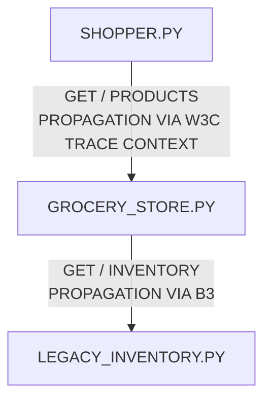

# Chapter 4 examples

This folder contains examples for Chapter 4.

## Prerequisites

- Python 3.6+

## Setup

```
mkdir cloud_native_observability
python3 -m venv cloud_native_observability
source cloud_native_observability/bin/activate

pip install flask requests
pip install opentelemetry-api opentelemetry-sdk
pip install opentelemetry-propagator-b3

pip freeze | grep opentelemetry
opentelemetry-api==1.37.0
opentelemetry-propagator-b3==1.37.0
opentelemetry-sdk==1.37.0
opentelemetry-semantic-conventions==0.58b0
```

---

_Cloud Native Observability_
## Test
* terminal 01
  ```bash
  python ./legacy_inventory.py 
  ``` 
* terminal 02
  ```bash
  python ./grocery_store.py 
  ``` 
* terminal 03
  ```bash
  python ./shopper.py 
  ``` 

### System Architecture

```bash
SHOPPER.PY
    |
    | GET / PRODUCTS
    | PROPAGATION VIA W3C TRACE CONTEXT
    ↓
GROCERY_STORE.PY
    |
    | GET / INVENTORY
    | PROPAGATION VIA B3
    ↓
LEGACY_INVENTORY.PY
```